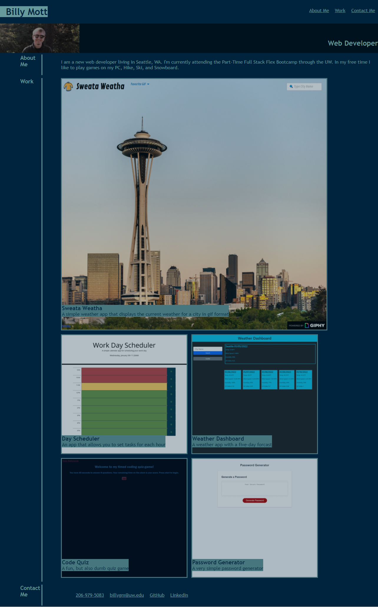

# My-Portfolio

This is my updated portfolio, it still needs a little work but I feel its a good start

I have replaced all my placeholder values with my work so far, but for some reason my live page will not update even after ive pushed up all my content

All the links in the contact me section are working and accurate.

[Portfolio: https://billygm.github.io/My-Portfolio/](https://billygm.github.io/My-Portfolio/)

[GitHub: https://github.com/Billygm/My-Portfolio](https://github.com/Billygm/My-Portfolio)

